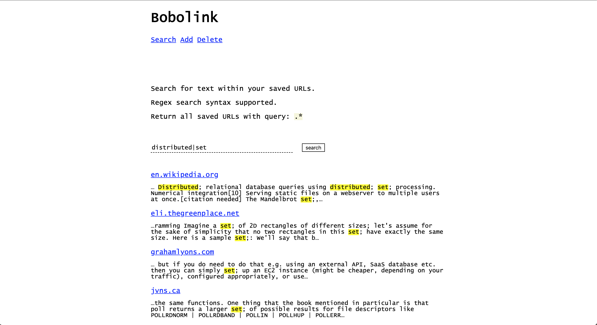
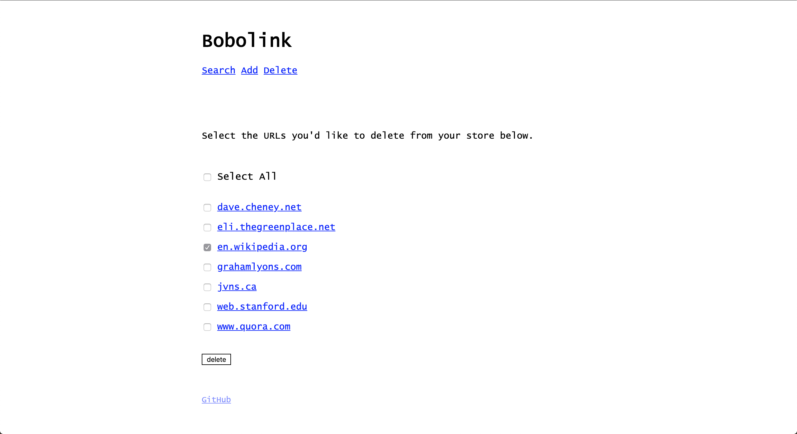

# Bobolink
Bobolink is a small tool that allows you to save links and search for them later. More specifically, Bobolink provides full text search on the body of HTML documents that you've added to your index. Bobolink is written in go. The frontend to the web service is written with go html templates and vanilla js [http://vanilla-js.com/]

### Motivation
I save lots of links without the use a bookmark manager. When I find a new article I'd like to reference or read at another time, I simply append it to a long-running text file I keep on my machine. A downside to this approach is that URLs alone often lack adequate detail of the contents of the web page, so grep'ing for an article by some keyword is not always possible. Bobolink addresses that: one can simply add URLs, search by some keyword and have returned all articles that mention these terms.

N.B. Bobolink is not a "read-it-later" tool and does not offer any such functionality; searches only return snippets of matching text only to highlight where article text matched a user's search query.

### Installation

`go get -u github.com/jtanza/bobolink` 

Bobolink requires an index to manage stored text. The path to this index can either be passed explicitly with each invocation of bobolink e.g.`--index-path=/opt/bobolink` or can be set once via the env variable `BOBOLINK_DIR=/opt/bobolink`
This directory can of course be anywhere you'd like, but I personally use `/opt/bobolink`

All the source HTML templates have been embedded as binary data (via go-bindata) so fetching the executable via `go get` is all that is required to run the web app as well.

### Usage
```
Usage:
  bobolink [flags]
  bobolink [command]

Available Commands:
  add         Adds urls to store
  find        Searches for urls
  help        Help about any command
  remove      Deletes urls from store
  server      Starts the bobolink web server

Flags:
  -h, --help                help for bobolink
  -i, --index-path string   path to bobolink index

Use "bobolink [command] --help" for more information about a command.
```

### Web App
If users do not wish to use bobolink via the CLI or would like to offload the requisite disk space needed for the document index to a remote server, a web interface is also provided. One can simply run:
```
user@remote $ bobolink server -p 25000
Listening on port :2500...
user@local $ ssh -L 8080:localhost:25000 user@remote -N
```
and access the web app in their browser. 

##### Web App Screenshots





### API
All the commands offered in the CLI are likewise offered over HTTP: 
```
$ bobolink find hash
URL: https://xlinux.nist.gov/dads/HTML/secondaryClustering.html
Match: …to create long run of filled slots away from a key hash position, e.g., along the probe sequence. 
See also primary clustering, clustering free, hash table, open addressing, clustering, linear probing,…
$ curl -d '{"query": "hash"}' localhost:8080/links/find
[{"Body":"...to create long run of filled slots away from a key hash position, e.g., along the probe sequence. 
See also primary clustering, clustering free, hash table, open addressing, clustering, linear probing...,",
"URL":"https://xlinux.nist.gov/dads/HTML/secondaryClustering.html"}]
```

All endpoints return data as JSON. However, if HTML is desired, once can simply request it.
```
$ curl -H "Accept: text/html" -d '{"query": "hash"}' localhost:8080/links/find
<ul>
  <li><a href="https://xlinux.nist.gov/dads/HTML/secondaryClustering.html">xlinux.nist.gov</a></li>
  <li>…to create long run of filled slots away from a key <mark>hash</mark>; position, e.g., along the probe sequence. See also primary clustering, clustering free, <mark>hash</mark>; table, open addressing, clustering, linear probing,…</li>
</ul>
```
